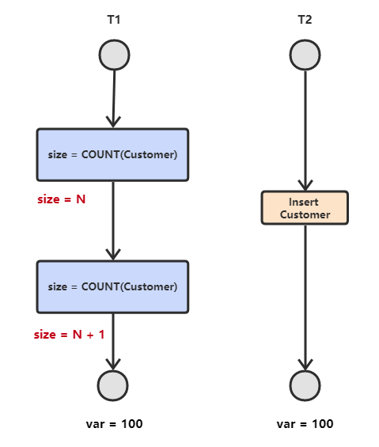
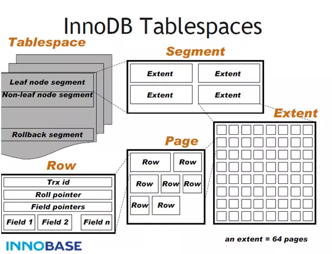
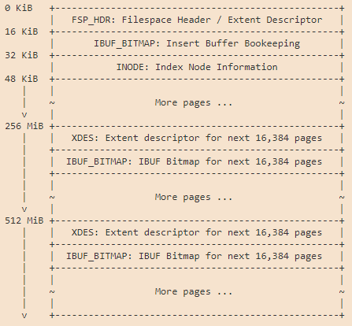
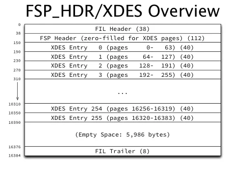
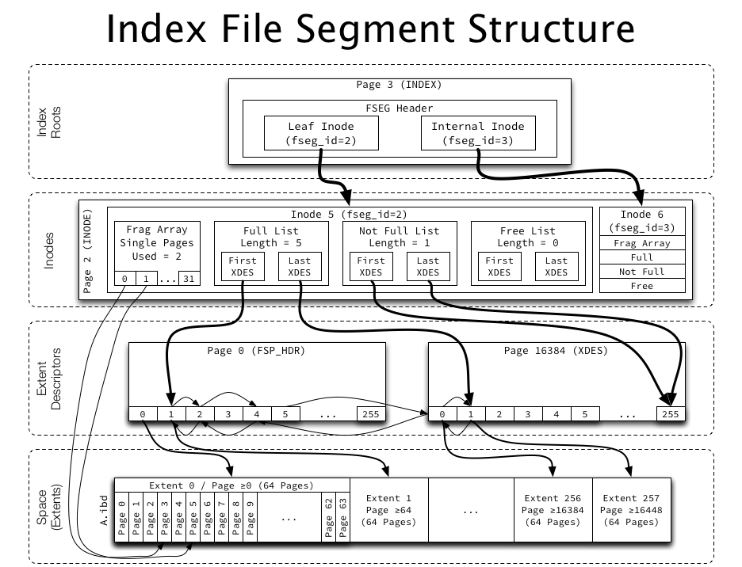

# mysql基础知识

## 1. mysql主键

主键:primary key,表中主要的键，每张表中只能有一个字段使用此属性

主要作用：用来唯一的约束该字段里面的数据，不能重复

主键约束：即主键对应的字段里面的数据不允许重复，如果重复，则数据操作（增改）失败

主键分类：根据主键的字段类型，咱们可以将主键分为两类：

- 业务主键，使用真实的业务数据作为主键，例如学号、课程编号等等
- 逻辑主键，使用逻辑性的字段作为主键，字段没有业务含义，值有没有都没有关系，经常使用

## 2. mysql唯一键

唯一键：每张表中往往有多个字段需要具有唯一性，数据不能重复，但是在每张表中，只能有一个主键，因此唯一键用来解决表中多个字段需要具备唯一性的问题，唯一键的本质与主键差不多，唯一键默认允许字段为空，而且可以多个字段为空，因此，空字段不参与唯一性的比较。当唯一键满足非空条件的时候，其性质跟主键是一样的。

唯一键与主键的区别：唯一键允许字段值为空，并且允许多个空值存在

## 3. 索引

索引：系统根据某种算法，将已有的数据(未来可能新增的数据),单独建立一个文件，这个文件能够实现快速匹配数据，并且能够快速的找到对应的记录，几乎所有的索引都是建立在字段之上的。

索引的意义：

- 提升查询数据的效率
- 约束数据的有效性

增加索引的条件：

- 如果某个字段需要作为查询的条件经常使用，可以使用索引
- 如果某个字段需要进行数据的有效性约束，也可以使用索引(主键和唯一键)

索引的分类：

- 主键索引 (primary key)
- 唯一键索引 (unique key)
- 普通索引 (index)
- 全文索引 (fulltext index)

> 全文索引即根据文章内部的关键词进行索引，其最大的难度在于如何确定关键词

## 4. 范式

范式：Normal farmat ,是为了解决数据的存储和优化问题

在数据存储之后，范式能够通过关系寻找出来的数据，坚决不再重复存储，范式的终极目标是减少数据冗余

范式是一种分层结构的规范，共6层，分别为1NF、2NF、3NF、4NF、5NF、6NF，每一层都比上一层严格，若要满足下一层范式，其前提是先满足上一层范式。其中1NF是最底层的范式。6NF是最高层的范式，也最严格

MySQL数据属于关系型数据库，其存储数据的时候有些浪费空间，但也致力于节省空间，这就与范式想要解决的问题不谋而合，因此在设计数据库的时候，大都会利用范式来知道设计。但是数据库不单是要解决存储空间的问题，还要保证效率的问题，而范式只为解决存储空间的问题，所以数据库的设计又不能完全按照范式的要求来实现，因此在一般情况下，只需要满足前三种范式即可

1. 1NF

第一范式：在设计表存储数据的时候，如果表中设计的字段存储的数据，在取出来使用之前还需要额外的处理(拆分)，那么表的设计就不满足第一范式，第一范式要求字段的数据具有原子性，不再可分

例如：

id | 学校名称 | 起始时间，结束时间
-|-|-
1 | 哈尔滨工业大学 | 20170625,20170903
2 | 浙江大学 | 20170630,20170901

观察上表，咱们会发现表1的设计并没有什么问题，但是如果需求是查询各学校开始放假的日期呢？那显然上表的设计不满足1NF,数据不具有原子性。

拆分后的表

id | 学校名称 | 起始时间 | 结束时间
-|-|-|-
1 | 哈尔滨工业大学 | 20170625 | 20170903
2 | 浙江大学 | 20170630 | 20170901

2. 2NF

第二范式：在数据表的设计过程中，如果有复合主键(多字段主键),切表中有字段并不是由整个主键来确定，而是依赖复合主键中的某个字段(主键的部分),也就是说存在字段依赖主键的部分的问题(称之为部分依赖),第二范式就是解决表设计中不允许出现部分依赖

例如，设计一个教室授课表

教师 | 性别 | 课程 | 授课地点
-|-|-|-
许仙 | 男 | <<如何追到心爱的女生>> | 杭州西湖
白娘子 | 女 | <<论女人的恋爱修养>> | 雷峰塔
白娘子 | 女 | <<如何打赢持久战>> | 金山寺

观察上表，教师不能作为独立的主键，需要与授课的地点相结合才能作为主键(复合主键，每个教师的某个课程只能在固定的地点上)，其中性别依赖于具体的老师，而课程依赖于授课地点，这就出现了表的字段依赖于部分的主键的问题，从而导致不满足第二范式

解决方案1：将教师和性别，课程和授课地点，分成两张表
解决方案2：取消复合主键，使用逻辑主键

在此，我们采用方案2

id | 教师 | 性别 | 课程 | 授课地点
-|-|-|-|-
1 | 许仙 | 男 | <<如何追到心爱的女生>> | 杭州西湖
2 | 白娘子 | 女 | <<论女人的恋爱修养>> | 雷峰塔
3 | 白娘子 | 女 | <<如何打赢持久战>> | 金山寺

3. 3NF
第三范式：需要满足第一范式和第二范式，理论上讲，每张表中的所有字段都应该直接依赖主键(逻辑主键，代表是业务主键)，如何表设计中存在一个字段，并不直接依赖主键，而是通过某个非主键字段依赖，最终实现主键依赖(把这种不是直接依赖主键，而是依赖非主键字段的依赖关系，称之为传递依赖)，第三范式主要解决的是表设计中出现的传递依赖的问题

id | 教师 | 性别 | 课程 | 授课地点
-|-|-|-|-
1 | 许仙 | 男 | <<如何追到心爱的女生>> | 杭州西湖
2 | 白娘子 | 女 | <<论女人的恋爱修养>> | 雷峰塔
3 | 白娘子 | 女 | <<如何打赢持久战>> | 金山寺

在以上表的设计中，性别依赖于教师，教师依赖于主键，课程依赖授课地点，授课地点依赖主键，因此性别和课程都存在传递依赖得问题

解决方案：将存在传递依赖的字段以及依赖的字段本身单独取出来，形成一个单独的表，然后在需要使用对应信息的时候，把对应的实体表的主键添加进来

id | 教师 | 性别 |
-|-|-
1 | 许仙 | 男 |
2 | 白娘子 | 女 |
3 | 白娘子 | 女 |

address_id | 课程 | 授课地点
-|-|-
1 | 许仙 | <<如何追到心爱的女孩>> | 杭州西湖 
2 | 白娘子 | <<论女人的恋爱修养>> | 雷峰塔
3 | 白娘子 | <<如何打赢持久战>> | 金山寺

id | Teacher_id | Address_id |
-|-|-
1 | 1 | 1 |
2 | 2 | 2 |
3 | 3 | 3 |

总结：

1NF：字段不可分
2NF:有主键，非主键字段依赖主键
3NF:非主键字段不能相互依赖

解释：
1NF：原子性，字段不可再分，否则就不是关系型数据库
2NF：唯一性，一个表只说明一个事物，表中的每一列的字段你都和主键相关
3NF:每列都与主键有直接关系，不存在依赖传递，更进一步

## 5.连接查询

连接查询：将多张表(大于等于2张表)按照某个指定的条件进行数据的拼接，其最终结果记录数可能有变化，但字段数一定会增加

连接查询的意义：在用户查询数据的时候，需要显示的数据来自于多张表

1. 内连接
2. 外连接
3. 自然连接
4. 交叉连接

### 交叉连接
交叉连接：cross join，从一张表中循环取出每一条记录，每条记录都去另外一张表进行匹配，匹配的结果都保留，而连接本身的字段会增加，最终形成的结果为笛卡尔积形式

其结果与多表查询相同

    select * from student cross join class;
    select * from student,class;

实际上，这种查询方式没有意义感觉,其实就是查询两种表的数据，比如第一张表的个数是m,第二张表的个数是n,那么查询的结果就是m*n条数据

### 内连接

内连接:inner join ，从坐标中取出每一条记录，和右表中的所有记录进行匹配，并且仅当某个条件在左表则不保留。和右表中的值相同的时候，结果才保留。

基本语法: 左表 + inner join + 右表 + on + 左表.字段 = 右表.字段

    select * from student inner join class on student.grade = class.grade;
    select * from student join class on student.grade = class.grade;

最后，内连接可以没有连接条件，即可以没有on后面的内容，这时候内连接的结果全部保留，与交叉连接结果相同。而且在内连接的时候可以用where关键字替代on ,但where没有on的效率高

### 外连接

外连接:left/right join 以某张表为主表，取出里面的所有记录，然后让主表中的每条记录都与另外一张表进行连接，不管是否匹配成功，其最终的结果都会保留，匹配成功，则正确保留，匹配失败，则将另一张表的字段都设置为NULL

基本语法：左表 + left/right join + 右表 + on + 左表.字段 = 右表.字段

left join:左外连接，以左表为主表
right join:右外连接，以右表为主表

### 自然连接

自然连接：nature join ，自然连接其实就是自动匹配连接条件，系统以两表中同名字段作为匹配的条件，如果两表有多个同名字段，那就都作为匹配条件，自然连接分为自然外连接和自然内连接

自然内连接基本语法：左表 + nature join + 右表
自然外连接基本语法：左表 + nature left/right join + 右表

## 6.外键

外键：foregin key，外面的键，即不在自己表中的键。如果一张表中有一个非主键的字段指向另外一张表的主键，那么该字段就称之为外键，每张表中，可以有多个外键

外键的默认作用有两个：分别对子表和父表进行约束

1. 约束子表,在子表(有外键的表)进行数据写操作的时候(增和改),如果对应的外键字段在父表(外键指向的表)找不到对应的匹配，那么操作失败

2. 约束父表：在父表进行数据的写操作(删和改)的时候，如果对应的主键字段在字表中已经被数据引用了，则操作失败

举例一个订单的表，里面放着某个产品的订单信息，当你修改或者删除该订单的时候，如果该订单的产品不在产品的表中，会出现错误。反之，当你把产品的信息删除或者修改了，同样也会影响订单的表，所以这时候就需要进行外键的约束了

## 7. 联合查询

联合查询：union，将多次查询的结果，在字段数量相同的情况下，在记录的层次上进行拼接

基本语法：select 语句1 + union + 选项 + select 语句2 + ....

union选项:
- all，无论重复与否，保留所有的选项
- distinct:表示去重，为默认选项

举例:

    //联合查询，默认去重    
    select * from class union distinct select * from class;
    //联合查询，保留所有的记录
    select * from class union all selct * from class;

联合查询的意义：

- 查询同一张表，按时需要不同，例如查询学生信息，要求男生按年龄升序排序，女生按年龄降序排序

- 多表查询，多张表的结构是完全一样的，保持的数据结构有是一样的。此外，如果数据量非常的大，就要进行分表(垂直分表和水平分表)

> 注意，联合查询的时候注意加()和加limit

## 7. 子查询

子查询：sub query,查询是在某个查询结果之上进行的，一条select语句内部包含了另外一条select语句

子查询分为两种类型：

- 按结果分类
    - 标量子查询:子查询得到的结果是一行一列，出现的位置在where之后
    - 列子查询：子查询得到的结果是一列多行，出现的位置在where之后
        - in/not in 等于列表中的任意一个,解释a=in(10,20,30)只要等于里面的任意一个即可
        - any/some 和子查询返回的某一个值进行比较,解释a>any(10,20,30)只要比最小的大就行
        - all 和子查询返回的所有值进行比较 ,解释a>all(10,20,30)大于里面所有的值
    - 行子查询:子查询得到的结果是多行一列(多行多列),出现的位置在where之后
    - 表子查询：子查询得到的结果是多行多列,出现的位置在from之后
- 按位置分类
    
    -select子查询:子查询出现在select之后
        - 仅支持标量子查询
    - from子查询:子查询出现在from之后
    - where子查询：子查询出现在where条件之中
        - 这个一般会有三种情况：一种是一行一列(标量子查询)、一列多行(列子查询)、多行多列(行子查询)
    - exists子查询：子查询出现在exists里面

## 8. 视图

视图：view,是一种有结构(有行有列),但没有结果(结构中不真实存放数据)的虚拟表。虚拟表的结构原来不是自己定义的，而是从对应的基表(视图的数据来源)中产生的

基本语法：create view + 视图名 + as + select语句

其中，select语句可以是普通查询，也可以是连接查询、联合查询、子查询等

此外，视图根据数据的来源，可以分为单表视图和多表视图

视图的主要作用：视图可以节省sql语句，将一条复杂的查询语句用视图来进行封装，以后可以直接对视图进行操作

数据安全，视图操作主要针对查询的，如果对视图结构进行处理，并不会影响基表的数据

视图往往会用在大型项目中，而且是多系统中，可以对外提供有用的数据，但是隐藏关键的数据

## 9. 事务

案例：银行的数据库里面存储着用户的账户信息表，当用户 A 想用户 B 转账的时候，正常情况下，A 账户的余额减少，B 账户的余额增加；但是由于某种原因（例如突然断电），当 A 账户的余额减少之后，B 账户的余额并没有增加，这就造成了数据库数据的安全隐患。

解决方案：当 A 账户的余额减少之后，不要立即修改数据表，而是在确认 B 账户的余额增加之后，同时修改数据表。

通过前面的案例及解决方案，我们就引出了一个全新的概念，那就是：事务，即
一系列将要发生或正在发生的连续操作。

而事务安全，是一种保护连续操作同时实现（完成）的机制。事务安全的意义就是，保证数据操作的完整性。

1. 第一步，开启事务,start transaction
2. 第二步,减少A账户的余额
3. 第三步,增加B账户的余额
4. 第四步,提交事务或回滚事务,提交commit 回滚rollback,如果我们选择提交事务，则将事务日志存储的记录直接更新到数据库，并清除事务日志。如果我们选择回滚事务，则直接将事务日志清除，所有在开启事务至回滚事务之间的操作失效，保持原有的数据库记录不变

事务的原理：在事务开之后，所有的操作都会被临时存储到事务的日志，事务日志只有在收到commit命令之后，才会将操作同步到数据表，其他任何情况下都会清空事务日志，例如突然断开了连接、收到了rollback命令了

我们来分析一下MySQL的操作过程：

1. 客户端与服务器端建立连接，同时开启一个临时的事务日志，此事务日志当前用户的当次连接
2. 在客户端用sql语句执行写操作，客户端收到sql语句，执行，将结果直接写入数据表，并将数据表同步到数据库
3. 我们在客户端开启事务，则服务器端原来的操作机制被改变，后续所有的操作都会被先写到临时的日志文件
4. 在客户端执行sql语句的时候，服务器接收到sql语句，执行，将结果写入到临时的日志文件，并不将结果同步到数据库
5. 在客户端执行查询操作，服务端直接从临时日志文件中捞取数据，返回给客户端
6. 在客户端执行commit或者rollback命令，清空临时日志文件，如果是commit命令，则将结果同步到数据库，如果是rollback命令，则不同步

通过上面的分析，我们就知道了为什么在我们同时开启两个 MySQL 客户端窗口（两次连接）时，当一个窗口开启事务并执行 SQL 操作之后，另一个窗口在查询时并不会收到同步数据。原因就在于，当我们开启事务之后，服务端会将后续的操作都写入到临时日志文件，而另一个窗口在查询的时候，则是直接从数据库捞取数据，并会不走前一个的临时日志文件。

事务的特性，可以简单的概括为ACID，具体为：

- 原子性：Atomic，表示事务的整个操作是一个整体，是不可分割的，要么全部成功，要么全部失败；
- 一致性：Consistency，表示事务操作的前后，数据表中的数据处于一致状态；
- 隔离性：Isolation，表示不同的事务操作之间是相互隔离的，互不影响；
- 持久性：Durability，表示事务一旦提交，将不可修改，永久性的改变数据表中的数据。

## 10. 触发器

网上购物，根据生产订单的类型，商品的库存量对应的进行增和减。此案例涉及到两张表，分别为订单表和商品表。下单时候，商品表的库存减少，退单时候，商品表库存增加，如何实现？

触发器:trigger,是指事先为某张表绑定一段代码，当表中的某些内容发生改变(增、删、该)的时候，系统会自动触发代码执行

触发器包含三个要素:
事件类型:增删改，即insert/delete/update
触发时间：事件类型前和后，即before和after
触发对象：表中的每一条记录，即整张表

每张表只能拥有一种触发时间的一种事件类型的触发器，即每张表最多可以拥有6种触发器

delimiter 自定义符号 -- 临时修改语句结束符，在后续语句中只有遇到自定义符号才会结束语句

create trigger + 触发器名称 + 触发器时间 + 事件类型 on 表名 for each row

begin -- 代表触发器内容开始

-- 触发器内容主体，每行用分号结尾

end -- 代表触发器内容结束

自定义符号 -- 用于结束语句

delimiter ; -- 恢复语句结束符

## 11. 存储过程

存储过程简称过程,procedure,是一种用来处理数据(增删改)的方式。简单点，我们可以理解为没有返回值的函数

create procedure 过程名([参数列表])

begin 

    ---过程体
end    

# mysql对千万级别的大表如何优化

很多人第一反应是各种切分；我给的顺序是:

第一在表、字段设计阶段，考虑更优的存储和运算

第二在数据库本身提供的优化手段上---索引

第三加缓存，这里你可使用应用层的缓存memcached,redis，也可以使用SQL中的自带的缓存功能

第三以上都做了后，还是慢，就做主从复制或主主复制，读写分离，可以在应用层做，效率高，也可以用三方工具

第四如果以上都做了还是慢，mysql自带分区表，先试试这个，对你的应用是透明的，无需更改代码,但是sql语句是需要针对分区表做优化的，sql条件中要带上分区条件的列，从而使查询定位到少量的分区上，否则就会扫描全部分区

第五如果以上都做了，那就先做垂直拆分，其实就是根据你模块的耦合度，将一个大的系统分为多个小的系统，也就是分布式系统

第六才是水平切分，针对数据量大的表，这一步最麻烦，最能考验技术水平，要选择一个合理的sharding key,为了有好的查询效率，表结构也要改动，做一定的冗余，应用也要改，sql中尽量带sharding key，将数据定位到限定的表上去查，而不是扫描全部的表

mysql数据库一般都是按照这个步骤去演化的，成本也是由低到高

最后，我们还可以优化自己的sql语句，通过profile和慢查询日志找到慢的点针对性的优化，同时也可以通过mysqlslap进行压力测试

# MySQL常见面试题

## 1. 什么是事务？事务的特性是什么？分别解释一下

事务是指作为单个逻辑工作单元执行的一系列操作，可以被看做一个单元的一系列sql语句的集合，要么完全执行，要么完全不执行

如果不对数据库进行并发控制，可能会产生脏读、非重复读、幻像读、丢失修改的异常情况

事务的特性ACID分别解释如下：

1. 原子性

原子性是指事务是一个不可分割的工作单位，事务中的操作要么全部成功，要么全部失败。比如在同一事务中的sql语句，要么全部执行成功，要么全部执行失败

2. 一致性

事务必须使数据库从一个一致性状态变换到另外一个一致性状态。以转账为例，A向B转账，假设转账之前这两个用户的钱加起来总共是2000，那么A向B转账之后，不管这两个账号怎么转，A用户的钱和B用户的钱加起来的总额还是2000，这个就是事务的一致性

3. 隔离性

隔离性是当多个用户并发访问数据库时，比如操作同一张表时，数据库为每一个用户开启的事务，不能被其他事务的操作干扰，多个并发事务之间要相互隔离

即要达到这么一种效果：对于任意两个并发的事务t1和t2,在事务t1看来，t2要么在t1开始之前就已经结束，要么在t1结束之后才开始，这么每个事务都感觉不到有其他的事务在并发的执行

4. 持久性

一旦事务提交，则其所作的修改将会永远保存到数据库中。即使系统发生崩溃，事务执行的结果也不能丢失。

举例说明：

A向B汇钱100

1. 读出A账号余额(500)
2. A账号扣钱操作(500-100)
3. 结果写回A账号(400)
4. 读出B账号余额(500)
5. B账号做加法操作(500+100)
6. 结果写回B账号(600)

原子性：保证1-6所有过程要么都执行，要么都不执行
一致性：转账前，A和B的账户共有500+500=1000,转账后，A和B的账户共有400+600=1000元
隔离性：在A向B转账的整个过程中，只要事务还没有提交，查询A账号和B账号的时候，两个账号的钱的数量都不会有变化
持久性：一旦转账成功(事务提交),两个账户的里面的前就真的发生变化

## 2. 什么是脏读？幻读？不可重复读？什么是事务的隔离级别？mysql中默认的隔离级别是？

T1和t2两个事务都对一个数据进行修改，t1先修改，t2随后修改，t2的修改覆盖了t1的修改

### 脏读

(针对未提交数据)如果一个事务中对数据进行了更新，但事务还没有提交，另一个事务可以看到该事务没有提交的更新结果，这样造成的问题是，如果第一个事务回滚，那么第二个事务在此之前看到的数据就是一笔脏数据(脏读也称无效数据读出。一个事务读取另外一个事务还没有提交的数据叫脏读)

***例子：***

mary的原工资为1000，财务人员将mary的工资改为了8000(但未提交事务)

mary读取自己的工资，发现自己的工资变为了8000，欢天喜地！

而财务发现操作有误，回滚了事务，mary的工资变为了1000

像这样，mary记取的工资数8000是一个脏数据

解决方案：将数据库的事务隔离级别调整到READ_COMMITTED

***图解：***

t1修改了一个数据，t2随后读取这个数据，如果t1撤销了这次修改，那么t2读取的就是脏数据

### 不可重复读

是指在一个事务内，多次读同一个数据。在这个事务还没有结束时候，另外一个事务也访问该同一数据。那么，在第一个事务中的两次读取数据之间，由于第二个事务的修改，那么第一个事务两次读到的数据可能是不一样的。这样，在一个事务内两次读到的数据是不一样的，因此 称为不可重复读。(同时操作，事务1分别读取事务2操作时和提交后的数据，读取的记录内容不一致。不可重复读是指在同一个事务中，两个相同的查询返回了不同的结果)

例子：

1. 在事务1中,mary读取了自己的工资为1000,操作并没有完成

    con1 = getConnection();
    select salary from employee empId = "mary";

2. 在事务2中，这时财务人员修改了mary的工资为2000,并提交了事务

    con2 = getConnection();
    update employee set salary = 2000;
    con2.commit()

3. 在事务1中，mary再次读取自己的工资的时候，工资变为了2000

解决办法：如果只有在修改事务完全提交之后才能读取数据，则可以避免该问题。把数据库的事务隔离级别调整到repeatble_read

图解：

### 幻读

事务t1读取一条指定的where子句所返回的结果集，然后t2事务新插入一行记录，这行记录恰好满足t1所使用的查询条件。然后t1再次对表进程检索，但又看到了t2插入的数据.(和可重复读类似，但是事务2的数据操作仅仅是插入和删除，不是修改数据，读取的记录数量前后不一致)

幻读的重点在于新增或者删除(数据条数变化)

例子：

1. 目前工资1000的员工有10个，事务1，读取所有工资为1000的员工(共读取10条记录)

    con1 = getConnection();
    select * from employee where salary = 1000;

2. 这时候，另一个事务向employee表插入了一条员工记录，工资也为1000

    con2 = getConnection();
    Insert into employee(empId,salary) values("LiLi",1000);
    con2.commit();

3. 事务1再次读取所有工资为1000的员工(共读取了11条记录，产生了幻读

    //con1
    select * from employee where salary=1000;

解决办法：如果在操作事务完成数据处理之前，任何其他事务都不可以添加新的数据，则可避免该问题，把数据库的事务隔离级别调整为serializable_read

图解：

### 事务的隔离级别 --- 你可以理解为这是事务中的的锁

1. 串行化(serializeble)  一般不需要手动加锁

最高级别的事务隔离级别，所有的事务一个接一个执行，可以避免幻读

2. 可重复读(repeatable read) 这是mysql的默认隔离级别

重复读，就是在开始读取数据(事务开启)时，不再允许修改操作

重复读可以解决不可重复读问题，不可重复读对应的是修改，即update操作，但又可能出现幻读问题。因为幻读对应的是insert操作

3. 读已提交(read committed) 需要手动加锁

读提交，顾名思义，就是一个事务要等待另外一个事务提交之后才能读取数据

若有事务对数据进行更新操作时，读操作事务要等待这个更新操作事务提交之后才能读取数据，可以解决脏读的问题

4. 读未提交(read uncommitted)  需要手动加锁

顾名思义，一个事务可以读取另外一个事务未提交的数据

> 一般情况下我们要弄明白一个问题:为什么需要锁？多线程的时候，我们如果不加锁的话，那么不同的线程争夺cpu的控制权必然会对相同的数据进行不同的操作，比如线程1改写成0，线程2改写成1，那么最终的结果可能是000011111111... 所以，当线程1在修改数据的时候我们必然要对数据加锁,这个很容易理解。那么在数据库里面的加锁是一种什么情况呢？详细的请看下面的锁的分析

## 3.mysql中有哪些锁？分别介绍下

### 乐观锁 --- 从使用方式上

用数据库版本(version)记录机制实现，这是乐观锁最常用的一种实现方式。何为数据版本？即为数据增加一个版本标识，一般是通过为数据库表增加一个数字类型的version字段来实现。当读取数据的时候，将version字段的值一同读出，数据每更新一次，对此version值加1.当我们提交更新的时候，判断数据库表对应记录的当前版本信息与第一次取出的version值进行比对，如果数据库表当前版本与第一次取出的version值相等，则予以更新，否则认为是过期数据

举例：

数据库表设计，三个字段，分别是id,value,version

    select id,vlaue,version form TABLE where id=#{id}

每次更新表中value值字段的时候，为了防止冲突，需要进行下面的操作

    update TABLE set value=2,version=version+1 where id=#{id} and version=#{version}

### 悲观锁 --- 从使用方式上

与乐观锁相对应的就是悲观锁了。悲观锁是在操作数据的时候，认为此操作会出现数据冲突，所以在进行每次操作时候都要通过获取锁才能进行相同数据的操作

悲观锁涉及到共享锁和拍他锁。共享锁和排他锁是悲观锁的不同的实现

以排它锁为例：

要使用悲观锁，我们必须关闭MySQL数据库的自动提交属性，因为MySQL默认使用的是autocommit模式，也就是说，当你执行一个更新操作后，MySQL会立刻将结果进行提交

    set autocommit = 0;
    #设置完autocommit后，我们就可以执行我们正常的业务了
    #1. 开始事务
    begin;/begin work;/start transaction;
    #2. 查询表信息
    select status from TABLE where id=1 for update;
    #3. 插入一条数据
    insert into TABLE (id,value) vlaues(2,2);
    #4. 修改数据为
    update TABLE set value=2 where id=1;
    #5. 提交事务
    commit/commit work;

### 共享锁----从数据的操作类型上看就是读锁

共享锁又称读锁(read lock),是读取操作创建的锁。其他的用户可以并发的读取数据，但任何事务都不能对数据进行修改(获取数据上的排他锁)，直到已释放所有共享锁

如果事务T对数据A加上共享锁以后，则其他的事务只能对再加共享锁，不能加排他锁。获得共享锁的事务只能读数据，不能修改数据

打开第一个查询窗口

    begin;/begin work;/start transaction;
    select * from TABLE where id=1 lock in share mode;

然后在另一个查询窗口中对ID为1的数据进行更新

    update TABLE set name="www.baidu.com" where id=1;

此时，操作界面处于卡顿状态，过了超时间，提示错误信息

如果在超时前，执行了commit ，此更新语句会成功

    [SQL]update  test_one set name="www.souyunku.com" where id =1;
    [Err] 1205 - Lock wait timeout exceeded; try restarting transaction

加上共享锁后，也提示错误信息

    update test_one set name="www.souyunku.com" where id =1 lock in share mode;
    [SQL]update  test_one set name="www.souyunku.com" where id =1 lock in share mode;
    [Err] 1064 - You have an error in your SQL syntax; check the manual that corresponds to your MySQL server version for the right syntax to use near 'lock in share mode' at line 1

在查询语句后面增加lock in share mode,mysql会对查询结果中的每行都加上共享锁，当没有其他的线程对查询结果集中的任何一行使用排他锁时候，可以成功申请共享锁，否则会阻塞。其他线程也可以读取使用了共享锁的表

加上共享锁之后，对于update/insert/delete语句会自动加上排它锁

### 排他锁 --- 从数据的操作类型上看的话就是写锁

排它锁也称写锁

若事务 1 对数据对象 A 加上 X 锁，事务 1 可以读 A 也可以修改 A，其他事务不能再对 A 加任何锁，直到事物 1 释放 A 上的锁。这保证了其他事务在事物 1 释放 A 上的锁之前不能再读取和修改 A。排它锁会阻塞所有的排它锁和共享锁

读取为什么要加读锁呢：防止数据在被读取的时候被别的线程加上写锁

使用方式：在需要执行的语句后面加上 for update 就可以了

### 行锁 --- 从对数据操作的粒度上分的话就是锁定一行

行锁又分为共享锁和拍他锁，字面理解的话，就是给某一行加上锁，也就是一条记录加锁

    #结果集的数据都会加共享锁
    SELECT * from TABLE where id = "1"  lock in share mode;

    #加上排它锁
    select status from TABLE where id=1 for update;

### 表锁 --- 从对数据的操作粒度上来分的话就是锁定整个表

如何加表锁

innodb 的行锁是在有索引的情况下,没有索引的表是锁定全表的.

Innodb中的行锁与表锁

前面提到过，在 Innodb 引擎中既支持行锁也支持表锁，那么什么时候会锁住整张表，什么时候或只锁住一行呢？ 只有通过索引条件检索数据，InnoDB 才使用行级锁，否则，InnoDB 将使用表锁！

在实际应用中，要特别注意 InnoDB 行锁的这一特性，不然的话，可能导致大量的锁冲突，从而影响并发性能。

行级锁都是基于索引的，如果一条 SQL 语句用不到索引是不会使用行级锁的，会使用表级锁。行级锁的缺点是：由于需要请求大量的锁资源，所以速度慢，内存消耗大。

### 锁的算法

Record Lock

记录锁（Record Lock）是加到索引记录上的锁，假设我们存在下面的一张表 users：

    CREATE TABLE users(
        id INT NOT NULL AUTO_INCREMENT,
        last_name VARCHAR(255) NOT NULL,
        first_name VARCHAR(255),
        age INT,
        PRIMARY KEY(id),
        KEY(last_name),
        KEY(age)
    );

如果我们使用 id 或者 last_name 作为 SQL 中 WHERE 语句的过滤条件，那么 InnoDB 就可以通过索引建立的 B+ 树找到行记录并添加索引，但是如果使用 first_name 作为过滤条件时，由于 InnoDB 不知道待修改的记录具体存放的位置，也无法对将要修改哪条记录提前做出判断就会锁定整个表。

Gap Lock

记录锁是在存储引擎中最为常见的锁，除了记录锁之外，InnoDB 中还存在间隙锁（Gap Lock），间隙锁是对索引记录中的一段连续区域的锁；当使用类似 SELECT * FROM users WHERE id BETWEEN 10 AND 20 FOR UPDATE; 的 SQL 语句时，就会阻止其他事务向表中插入 id = 15 的记录，因为整个范围都被间隙锁锁定了。

虽然间隙锁中也分为共享锁和互斥锁，不过它们之间并不是互斥的，也就是不同的事务可以同时持有一段相同范围的共享锁和互斥锁，它唯一阻止的就是其他事务向这个范围中添加新的记录。

Next-Key Lock

Next-Key 锁相比前两者就稍微有一些复杂，它是记录锁和记录前的间隙锁的结合，在 users 表中有以下记录：

|   id | last_name   | first_name   |   age |
|------|-------------|--------------|-------|
|    4 | stark       | tony         |    21 |
|    1 | tom         | hiddleston   |    30 |
|    3 | morgan      | freeman      |    40 |
|    5 | jeff        | dean         |    50 |
|    2 | donald      | trump        |    80 |

如果使用 Next-Key 锁，那么 Next-Key 锁就可以在需要的时候锁定以下的范围：

    (-∞, 21]
    (21, 30]
    (30, 40]
    (40, 50]
    (50, 80]
    (80, ∞)

既然叫 Next-Key 锁，锁定的应该是当前值和后面的范围，但是实际上却不是，Next-Key 锁锁定的是当前值和前面的范围。

当我们更新一条记录，比如 SELECT * FROM users WHERE age = 30 FOR UPDATE;，InnoDB 不仅会在范围 (21, 30] 上加 Next-Key 锁，还会在这条记录后面的范围 (30, 40] 加间隙锁，所以插入 (21, 40] 范围内的记录都会被锁定。

## 4.什么是死锁？怎么解决？

所谓的死锁：是指两个或两个以上的进程在执行过程中，因争夺资源而造成的一种互相等待的现象，若无外力作用，他们都将无法推进下去。此时称系统处于死锁状态或系统产生了死锁，这些永远在互相等待的进程称为死锁进程。由于资源占用是互斥的，当某个进程提出申请资源后，使得有关进程在无外力协助下，永远分配不到必须的资源而无法进行

解除正在死锁的状态有两种方式：

第一种：1. 查询是否锁表

    show OPEN TABLES where In_use > 0

查询进程(如果有super权限，你可以看到所有线程，否则，只能看到自己的)
    show processlist

杀死进程id

    kill id 

第二种：1.查看当前的事务

    select * from INFORMATION_SCHEMA.INNODB_TRX;

查看当前锁定的事务

    SELECT * FROM INFORMATION_SCHEMA.INNODB_LOCKS;

查看当前等锁的事务

    SELECT * FROM INFORMATION_SCHEMA.INNODB_LOCK_WAITS;

杀死进程

    kill 进程ID    

## 5.大数据情况下如何做分页？

先快速定位需要获取的ID段、然后再关联

    select a.* from 表1 a,(select id from 表1 where 条件 limit 100000,20) b where a.id = b.id

## 6.myisam和innoDB的区别？至少5点

### myISAM

MySQL 5.5 版本之前的默认存储引擎，在 5.0 以前最大表存储空间最大 4G，5.0 以后最大 256TB。

Myisam 存储引擎由 .myd（数据）和 .myi（索引文件）组成，.frm文件存储表结构（所以存储引擎都有）

特性

- 并发性和锁级别 （对于读写混合的操作不好，为表级锁，写入和读互斥）
- 表损坏修复
- Myisam 表支持的索引类型（全文索引）
- Myisam 支持表压缩（压缩后，此表为只读，不可以写入。使用 myisampack 压缩）

应用场景

- 没有事务
- 只读类应用（插入不频繁，查询非常频繁）
- 空间类应用（唯一支持空间函数的引擎）
- 做很多 count 的计算

### InnoDB

MySQL 5.5 及之后版本的默认存储引擎

特性

- InnoDB为事务性存储引擎
- 完全支持事物的 ACID 特性
- Redo log （实现事务的持久性） 和 Undo log（为了实现事务的原子性，存储未完成事务log，用于回滚）
- InnoDB支持行级锁
- 行级锁可以最大程度的支持并发
- 行级锁是由存储引擎层实现的

应用场景

- 可靠性要求比较高，或者要求事务
- 表更新和查询都相当的频繁，并且行锁定的机会比较大的情况。

区别总结：

- MyISAM 不支持外键，而 InnoDB 支持
- MyISAM 是非事务安全型的，而 InnoDB 是事务安全型的。
- MyISAM 锁的粒度是表级，而 InnoDB 支持行级锁定。
- MyISAM 支持全文类型索引，而 InnoDB 不支持全文索引。
- MyISAM 相对简单，所以在效率上要优于 InnoDB，小型应用可以考虑使用 MyISAM。
- MyISAM 表是保存成文件的形式，在跨平台的数据转移中使用 MyISAM 存储会省去不少的麻烦。
- InnoDB 表比 MyISAM 表更安全，可以在保证数据不会丢失的情况下，切换非事务表到事务表（alter table tablename type=innodb）。

## 7. 什么是数据库索引？索引有哪几种类型？什么是最左前缀原则？索引算法有哪些？有什么区别？

索引能够轻易的将查询性能提升几个数量级

1. 对于非常小的表、大部分情况下简单的全表扫描比建立索引更高效
2. 对于中到大型的表，索引就非常有效
3. 但是对于特大的表，建立和维护索引的代价将会随之增长。这种情况下，需要用到一种技术可以直接区分出需要查询的一组数据，而不是一条记录一条记录的匹配，例如可以使用分区技术

索引是在存储引擎层实现的，而不是在服务器层实现的，所以不同存储引擎具有不同的索引类型和实现

### B Tree原理

定义一条数据记录为一个二元组[key,data],B tree是满足下列条件的数据结构：

- 所有叶节点具有相同的深度，也就是说b-tree是平衡的
- 一个节点中的Key从左到右非递减排列
- 如果某个指针的左右相邻key分别是keyi和keyi+1,且不为null,则该指针指向节点的(所有key >= keyi)且(key <= keyi+1)

查找算法：首先在根节点进行二分查找啊，如果找到则返回对应节点的data,否则在相应区间的指针指向的节点递归进行查找

由于插入删除新的数据记录会破坏b-tree的性质，因此在插入删除时候，需要对树进行一个分裂、合并、旋转等操作

### B + Tree

与 B-Tree 相比，B+Tree 有以下不同点：

- 每个节点的指针上限为 2d 而不是 2d+1（d 为节点的出度）；
- 内节点不存储 data，只存储 key；
- 叶子节点不存储指针。

一般在数据库系统或文件系统中使用的 B+Tree 结构都在经典 B+Tree 基础上进行了优化，在叶子节点增加了顺序访问指针，做这个优化的目的是为了提高区间访问的性能

### 哪些情况下不会适用索引

- 如果MySQL估计使用全表扫秒比使用索引快，则不适用索引。

- 例如，如果列key均匀分布在1和100之间，下面的查询使用索引就不是很好：select * from table_name where key>1 and key<90;

- 如果条件中有or，即使其中有条件带索引也不会使用

- 例如：select * from table_name where key1='a' or key2='b';如果在key1上有索引而在key2上没有索引，则该查询也不会走索引

- 复合索引，如果索引列不是复合索引的第一部分，则不使用索引（即不符合最左前缀）

- 例如，复合索引为(key1,key2),则查询select * from table_name where key2='b';将不会使用索引

- 如果like是以 % 开始的，则该列上的索引不会被使用。

- 例如select * from table_name where key1 like '%a'；该查询即使key1上存在索引，也不会被使用如果列类型是字符串，那一定要在条件中使用引号引起来，否则不会使用索引

- 如果列为字符串，则where条件中必须将字符常量值加引号，否则即使该列上存在索引，也不会被使用。例如,select * from table_name where key1=1;如果key1列保存的是字符串，即使key1上有索引，也不会被使用。

- 如果使用MEMORY/HEAP表，并且where条件中不使用“=”进行索引列，那么不会用到索引，head表只有在“=”的条件下才会使用索引

### 哪些情况下适合建立索引

- 为经常出现在关键字order by、group by、distinct后面的字段，建立索引。
- 在union等集合操作的结果集字段上，建立索引。其建立索引的目的同上。
- 为经常用作查询选择 where 后的字段，建立索引。
- 在经常用作表连接 join 的属性上，建立索引。
- 考虑使用索引覆盖。对数据很少被更新的表，如果用户经常只查询其中的几个字段，可以考虑在这几个字段上建立索引，从而将表的扫描改变为索引的扫描。

## 8. 某个表有近千万数据，CRUD比较慢，如何优化？分库分表了是怎么做的？分表分库了有什么问题？有用到中间件么?他们的原理知道么

简单的说，数据的切分就是通过某种特定的条件，将我们存放在同一数据库中的数据分散存放在多个数据库中(主机)中，以达到分散单台设备负载的效果，即分库分表

数据的切分根据其切分规则的类型，可以分为如下两种切分模式

- 垂直切分：把单一的表拆分成多个表，并分散到不同的数据库上
- 水平切分：根据表中数据的逻辑关系，将同一个表中的数据按照某种条件拆分到多塔数据库中

### 垂直切分---垂直分表和垂直分库

垂直分表 --- 也就是大表拆小表，基于列字段进行的。一般是表中的字段较多，将不常用的，数据较大，长度较长的拆分到扩展表中。一般是针对那种几百列的大表，也避免查询时，数据量太大造成的跨页问题

垂直分库 --- 针对的是一个系统中不同业务进行拆分，比如用户user一个库，商品product一个库，订单order一个库。切分后，放在多个服务器上，而不是一个服务器。为什么?我们想象一下，一个购物网站对外提供服务，会有用户、商品、订单等的CRUD。没有拆分之前，全部都是落到单一的库上的，这会让数据库的单库处理能力成为瓶颈。按垂直分库后，如果还是放在一个数据库服务器上，随着用户量的增大，这会然单个数据库的处理能力成为瓶颈，还有单个服务器的磁盘空间、内存非常吃紧

### 水平切分

水平分表 --- 针对数据量巨大的单张表（比如订单表），按照某种规则（RANGE,HASH取模等），切分到多张表里面去。 但是这些表还是在同一个库中，所以库级别的数据库操作还是有IO瓶颈。不建议采用

水平分库+分表 --- 在垂直分库的基础上，将存放用户表的服务器拆分成更小的服务器，user1,user2,user3,user1服务器上分别放我们user表中的不同的数据库部分，组成一个集群

水平分库分表切分规则

- RANGE从

0到10000一个表，10001到20000一个表；

- HASH取模

一个商场系统，一般都是将用户，订单作为主表，然后将和它们相关的作为附表，这样不会造成跨库事务之类的问题。 取用户id，然后hash取模，分配到不同的数据库上。
地理区域
比如按照华东，华南，华北这样来区分业务，七牛云应该就是如此。

- 时间

按照时间切分，就是将6个月前，甚至一年前的数据切出去放到另外的一张表，因为随着时间流逝，这些表的数据 被查询的概率变小，所以没必要和“热数据”放在一起，这个也是“冷热数据分离”。

### 切分后面临的问题

- 事务支持

分库分表后，就成了分布式事务了。如果依赖数据库本身的分布式事务管理功能去执行事务，将付出高昂的性能代价； 如果由应用程序去协助控制，形成程序逻辑上的事务，又会造成编程方面的负担。

- 跨库join

只要是进行切分，跨节点Join的问题是不可避免的。但是良好的设计和切分却可以减少此类情况的发生。解决这一问题的普遍做法是分两次查询实现。在第一次查询的结果集中找出关联数据的id,根据这些id发起第二次请求得到关联数据。

- 分库分表方案产品

跨节点的count,order by,group by以及聚合函数问题

这些是一类问题，因为它们都需要基于全部数据集合进行计算。多数的代理都不会自动处理合并工作。解决方案：与解决跨节点join问题的类似，分别在各个节点上得到结果后在应用程序端进行合并。和join不同的是每个结点的查询可以并行执行，因此很多时候它的速度要比单一大表快很多。但如果结果集很大，对应用程序内存的消耗是一个问题。

数据迁移，容量规划，扩容等问题

来自淘宝综合业务平台团队，它利用对2的倍数取余具有向前兼容的特性（如对4取余得1的数对2取余也是1）来分配数据，避免了行级别的数据迁移，但是依然需要进行表级别的迁移，同时对扩容规模和分表数量都有限制。总得来说，这些方案都不是十分的理想，多多少少都存在一些缺点，这也从一个侧面反映出了Sharding扩容的难度。

ID问题

一旦数据库被切分到多个物理结点上，我们将不能再依赖数据库自身的主键生成机制。一方面，某个分区数据库自生成的ID无法保证在全局上是唯一的；另一方面，应用程序在插入数据之前需要先获得ID,以便进行SQL路由.
一些常见的主键生成策略

## 9. MySQL主从复制的实现原理是什么

基本原理流程，3个线程以及之间的关联；

- 主：binlog线程——记录下所有改变了数据库数据的语句，放进master上的binlog中；
- 从：io线程——在使用start slave 之后，负责从master上拉取 binlog 内容，放进 自己的relay log中；
- 从：sql执行线程——执行relay log中的语句；

## 10.如果解决秒杀的性能问题和超卖的讨论

抢订单环节一般会带来2个问题：

　　1、高并发

　　比较火热的秒杀在线人数都是10w起的，如此之高的在线人数对于网站架构从前到后都是一种考验。

　　2、超卖

　　任何商品都会有数量上限，如何避免成功下订单买到商品的人数不超过商品数量的上限，这是每个抢购活动都要面临的难题。

解决方案1

　　将存库MySQL前移到Redis中，所有的写操作放到内存中，由于Redis中不存在锁故不会出现互相等待，并且由于Redis的写性能和读性能都远高于MySQL，这就解决了高并发下的性能问题。然后通过队列等异步手段，将变化的数据异步写入到DB中。

　　优点：解决性能问题

　　缺点：没有解决超卖问题，同时由于异步写入DB，存在某一时刻DB和Redis中数据不一致的风险。

解决方案2

　　引入队列，然后将所有写DB操作在单队列中排队，完全串行处理。当达到库存阀值的时候就不在消费队列，并关闭购买功能。这就解决了超卖问题。

　　优点：解决超卖问题，略微提升性能。

　　缺点：性能受限于队列处理机处理性能和DB的写入性能中最短的那个，另外多商品同时抢购的时候需要准备多条队列。

解决方案3

　　将提交操作变成两段式，先申请后确认。然后利用Redis的原子自增操作（相比较MySQL的自增来说没有空洞），同时利用Redis的事务特性来发号，保证拿到小于等于库存阀值的号的人都可以成功提交订单。**然后数据异步更新到DB中。

　　优点：解决超卖问题，库存读写都在内存中，故同时解决性能问题。

　　缺点：由于异步写入DB，可能存在数据不一致。另可能存在少买，也就是如果拿到号的人不真正下订单，可能库存减为0，但是订单数并没有达到库存阀值。

## 11. 深入理解mysql中的锁机制

### 什么是锁

锁是计算机协调多个进程或线程并发访问某个资源的机制

在数据库中，除传统的计算资源(如cpu,ram,io等)的争用之外，数据本身也是一种供许多用户共享的资源。如何保证数据并发访问的一致性、有效性是所有数据库必须解决的一个问题，锁冲突也是影响数据库并发访问性能的一个重要因素。

打个比方，我们到淘宝上买一件商品，商品只有一件库存，这时候如何还有一个人买，那么我们如何解决你买到还是另一个买到的问题？两个人同时下单，那么究竟应该是谁买到呢？这里面背后的逻辑就是两个线程争抢资源的问题还是

具体分析就是假设两个人同时去修改商品库存表中的库存字段，同时-1,那么，最终库存表中的数据会变成0,这就是不用锁的结果

这里肯定要用到事务，我们先从库存表中取出物理的数量，然后插入订单，付款后插入付款表，然后更新商品数量

这个过程中，使用锁可以对有限的资源进行保护，解决隔离和并发的矛盾

这里我们回忆一下，我们mysql的默认隔离的级别是repeatable read，也就意味着在当前的隔离级别中，是不可能出现脏读(事务和事务之间完全没有锁，操作的也都是同一个数据，事务1修改完后，事务2查询到事务1修改后的结果，此时，事务1还没有提交，解决办法:事务2只有在事务1提交后才能读到修改后的数据---RC)、不可重复读(在脏读的基础上，假设更新事务提交了，前后两次查询出来的结果是不一致的，解决办法：事务1提交后还是读不到事务2修改的数据,但是如果进行增删改操作的话，依然会根据修改后的值，注意这里的问题，读是快照读，增删改是当前读,这个东西就是我们通常所说的MVCC,简单来说就是读不加锁，读写不冲突,最后你commit后就可以看到最终的修改结果了)

你可以这么理解，在默认的mysql事务隔离级别中，已经很好的解决了脏读、不可重复读的问题了，存在的问题就是幻读，但是，经过测试，发现幻读问题在mysql中已经被解决掉了，可能在其他的数据库例如oracel中会存在幻读的情况？

在事务 A 提交前后，事务 B 读取到的 x 的值是什么呢？答案是：事务 B 在不同的隔离级别下，读取到的值不一样。

1. 如果事务 B 的隔离级别是读未提交（RU），那么两次读取均读取到 x 的最新值，即 20。

2. 如果事务 B 的隔离级别是读已提交（RC），那么第一次读取到旧值 10，第二次因为事务 A 已经提交，则读取到新值 20。

3. 如果事务 B 的隔离级别是可重复读或者串行（RR，S），则两次均读到旧值 10，不论事务 A 是否已经提交。

### mysql中是如何加锁的？

我们先来看一下什么是快照读，什么是当前读

在MVCC并发控制中，读操作分为两类:快照读和当前读

快照读:读取的是记录的可见版本(有可能是历史版本),不加锁

当前读:读取的是记录的最新版本，并且，当前读返回的记录都会加上锁，保证其他的事务不会再并发的修改这条数据

    快照读：简单的select操作，属于快照读，不加锁。(当然，也有例外，下面会分析)

    　　　　　　  select * from table where ?;

    当前读：特殊的读操作，插入/更新/删除操作，属于当前读，需要加锁。　　

    　　　　　　　select * from table where ? lock in share mode;

                select * from table where ? for update;

                insert into table values (…);

                update table set ? where ?;

                delete from table where ?;

    所有以上的语句，都属于当前读，读取记录的最新版本。并且，读取之后，还需要保证其他并发事务不能修改当前记录，对读取记录加锁。其中，除了第一条语句，对读取记录加S锁 (共享锁)外，其他的操作，都加的是X锁 (排它锁)。

总结分析：读是读自己的(快照读)，增删改是真实的(当前读)----这就是一个最为简单的通俗理解，当多个事务对同一个数据进行读的时候，读的数据是事务开始时候的那个值，无论其他的事务如何去修改这个值，那么在我当前的事务中是读不出修改后的值的;那么对于增删改的操作，多个事务同时对数据操作是操作的真实的值，但是，在某一个事务获取到锁的时候，另外的事务是无法进行操作的，也就是排它锁，只有等当前的事务释放了自己的锁之后，其他的事务才会去争抢锁

## 12.explain性能分析

expain出来的信息有10列，分别是id、select_type、table、type、possible_keys、key、key_len、ref、rows、Extra,下面对这些字段出现的可能进行解释:

###  id 

我的理解是SQL执行的顺序的标识,SQL从大到小的执行

1. id相同时，执行顺序由上至下

2. 如果是子查询，id的序号会递增，id值越大优先级越高，越先被执行

3. id如果相同，可以认为是一组，从上往下顺序执行；在所有组中，id值越大，优先级越高，越先执行

### select_type 

查询中每个select子句的类型

1. SIMPLE(简单SELECT,不使用UNION或子查询等)

2. PRIMARY(查询中若包含任何复杂的子部分,最外层的select被标记为PRIMARY)

3. UNION(UNION中的第二个或后面的SELECT语句)

4. DEPENDENT UNION(UNION中的第二个或后面的SELECT语句，取决于外面的查询)

5. UNION RESULT(UNION的结果)

6. SUBQUERY(子查询中的第一个SELECT)

7. DEPENDENT SUBQUERY(子查询中的第一个SELECT，取决于外面的查询)

8. DERIVED(派生表的SELECT, FROM子句的子查询)

9. UNCACHEABLE SUBQUERY(一个子查询的结果不能被缓存，必须重新评估外链接的第一行)

### table 

显示这一行的数据是关于哪张表的，有时不是真实的表名字,看到的是derivedx(x是个数字,我的理解是第几步执行的结果

### type  

表示MySQL在表中找到所需行的方式，又称“访问类型”

1. ALL：Full Table Scan， MySQL将遍历全表以找到匹配的行

2. index: Full Index Scan，index与ALL区别为index类型只遍历索引树

3. range:只检索给定范围的行，使用一个索引来选择行

4. ref: 表示上述表的连接匹配条件，即哪些列或常量被用于查找索引列上的值

5. eq_ref: 类似ref，区别就在使用的索引是唯一索引，对于每个索引键值，表中只有一条记录匹配，简单来说，就是多表连接中使用primary key或者 unique key作为关联条件

6. const、system: 当MySQL对查询某部分进行优化，并转换为一个常量时，使用这些类型访问。如将主键置于where列表中，MySQL就能将该查询转换为一个常量,system是const类型的特例，当查询的表只有一行的情况下，使用system

7. NULL: MySQL在优化过程中分解语句，执行时甚至不用访问表或索引，例如从一个索引列里选取最小值可以通过单独索引查找完成。

### possible_keys 

指出MySQL能使用哪个索引在表中找到记录，查询涉及到的字段上若存在索引，则该索引将被列出，但不一定被查询使用

该列完全独立于EXPLAIN输出所示的表的次序。这意味着在possible_keys中的某些键实际上不能按生成的表次序使用。
如果该列是NULL，则没有相关的索引。在这种情况下，可以通过检查WHERE子句看是否它引用某些列或适合索引的列来提高你的查询性能。如果是这样，创造一个适当的索引并且再次用EXPLAIN检查查询

### Key 

key列显示MySQL实际决定使用的键（索引）

如果没有选择索引，键是NULL。要想强制MySQL使用或忽视possible_keys列中的索引，在查询中使用FORCE INDEX、USE INDEX或者IGNORE INDEX。

### key_len

表示索引中使用的字节数，可通过该列计算查询中使用的索引的长度（key_len显示的值为索引字段的最大可能长度，并非实际使用长度，即key_len是根据表定义计算而得，不是通过表内检索出的）

### ref

表示上述表的连接匹配条件，即哪些列或常量被用于查找索引列上的值

### rows

表示MySQL根据表统计信息及索引选用情况，估算的找到所需的记录所需要读取的行数

### Extra

- Using where:列数据是从仅仅使用了索引中的信息而没有读取实际的行动的表返回的，这发生在对表的全部的请求列都是同一个索引的部分的时候，表示mysql服务器将在存储引擎检索行后再进行过滤

- Using temporary：表示MySQL需要使用临时表来存储结果集，常见于排序和分组查询

- Using filesort：MySQL中无法利用索引完成的排序操作称为“文件排序”

- Using join buffer：改值强调了在获取连接条件时没有使用索引，并且需要连接缓冲区来存储中间结果。如果出现了这个值，那应该注意，根据查询的具体情况可能需要添加索引来改进能。

- Impossible where：这个值强调了where语句会导致没有符合条件的行。

- Select tables optimized away：这个值意味着仅通过使用索引，优化器可能仅从聚合函数结果中返回一行

## 13. 索引优化

InnoDB 实现的表空间是在文件系统之上又构建的一层逻辑存储的空间管理(.ibd文件实际对应的就是一张表)

InnoDB 最小读写单位是 Page，page 采用默认的 16K

为了高效管理，又将连续的 64 个页称为 “extent”，还在 extents 上层添加了一个 segment inode 管理，最多可以管理 256 个 extents

一个表空间文件，实际就是一系列 Pages 的组合 (最大 232)，为了方便管理，你可以理解为做了三级的划分，分别是 segment、extent、page

段：ibd表空间文件会被分成多个段（segment），每个段和一个索引关联

区：段以区（extent）为大小进行增长或缩小，一个区只能属于一个段，并且大小为1MB

页：页（page）是区的子元素，默认大小16KB

行：一个页可以包含2到N行数据，这取决与每个行的大小，但因为限制了最小存放2行数据，所以每一行的大小必须小于8000bytes

1段 = 256区 = 256*64页

### 表空间

表空间实际就是innoDB中最大的存储单元了，我们所有的数据都存放在表空间中

这里，表空间分为两种不同的存储方式:

1. 共享表空间，说白了就是所有的表数据存储在一个叫做ibdata1的文件中
2. 独立表空间,这是应该是最常用的，就是每个表都有自己独立的表空间，不同的表都有自己的.ibd文件

> 注意，这里我们只讨论了数据段，没有去讨论其他的段，表空间是由不同的段组成的，常见的段有：数据段，索引段，回滚段等等。在 MySQL中，数据是按照B+树来存储，因此数据即索引，因此数据段的页即为B+树的叶子节点，索引段的页为B+树的非叶子节点

### 区 extend

这里,数据段里面放的就是我们的页---注意看我们左边的大小,页会根据区进一步的划分,一个区里会存放16,384个页,一共是256M大小的页,每到达16,384个页，就需要一个XDES来分割确保这是一个区

这里面第一个页FSP_HDR维护了这个区的相关信息,跟XDES一样，也是为了记录该区的一些详细信息的

### 数据页

我们再来看这张图，这是一个典型的表中页的结构,这里面需要关注的是
INODE和INDEX

个人感觉更像是将这些页面以b+树的形式存储起来,从root page(树的根节点)开始,根据inodes节点的信息找到区内具体的pages

